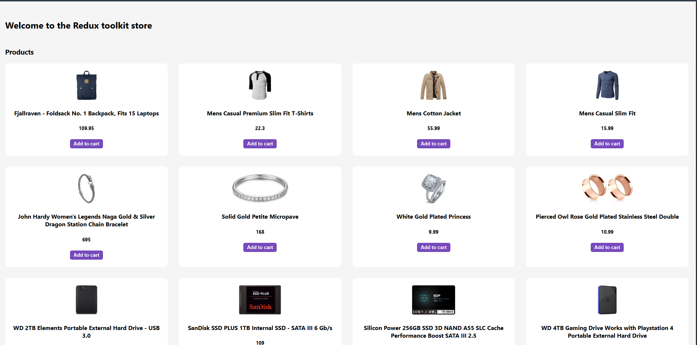
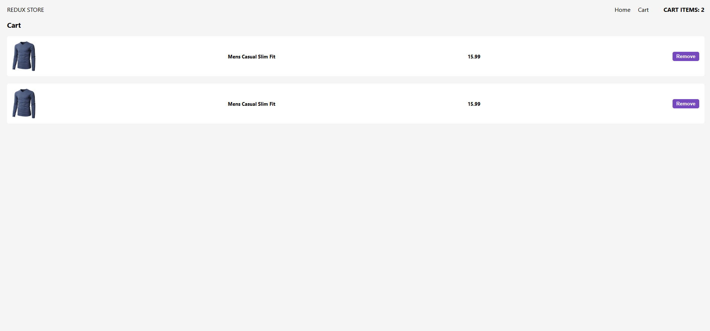

# React Redux Shopping Cart 🛒

A basic shopping cart application built with **React** and **Redux**, allowing users to add or remove products from the cart.

## 🧩 Features

- Display a list of products
- Add products to the cart
- Remove products from the cart
- Cart count updates in real-time

## ⚙️ Tech Stack

- **React** – UI Library
- **Redux** – State Management

## 📸 Screenshots

### 🏠 Home Page

### 🛒 Cart Page

